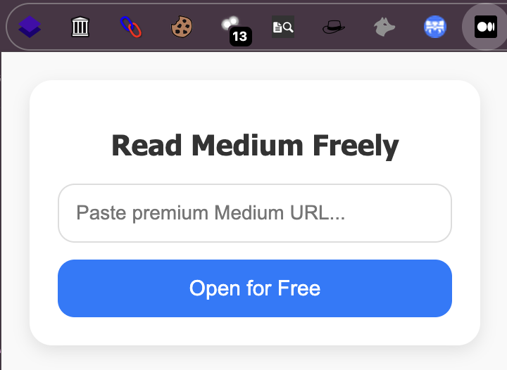

# 📖 Read Medium Freely – Chrome Extension

This Chrome extension allows users to **read premium Medium articles for free** by redirecting them through an alternative URL.

---

## 🚀 Features

Users simply enter the **premium Medium article URL**, and the extension automatically redirects it to `https://freedium.cfd/`, opening it in a new tab.

---

## 🛠️ Installation (Local Testing)

1. Clone this repository or download the ZIP file.
2. Open **Google Chrome** and go to:  
   `chrome://extensions/`
3. Enable **Developer Mode** (top right corner).
4. Click **"Load unpacked"** and select the project folder.
5. The extension will now be added to Chrome. Click on the icon to use it.

---

## 📂 Project Structure

freedium-extension/
├── manifest.json # Extension metadata
├── popup.html # UI interface
├── popup.js # Logic (URL redirection)
└── icon.png # Toolbar icon

---

---

## 🖥️ Screenshot

*(Replace this with an actual screenshot of the extension.)*

---

## ⚠️ Disclaimer

This extension is for **educational purposes, cybersecurity learning, and CTF challenges only**.  
It does **not** use Medium's official API and may violate its Terms of Service.  
Use it responsibly—public distribution is at your own risk.

---

## 👨‍💻 Author

- **Name:** [Your Name]
- **GitHub:** [github.com/mrkzqsmv]

---

## 📜 License

This project is licensed under the **MIT License** – see the [LICENSE](LICENSE) file for details.
